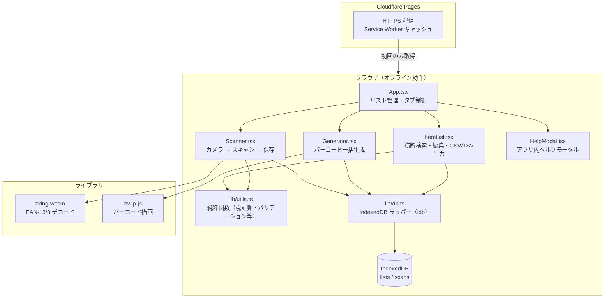

# JAN Sync

ドラッグストア・小売業の棚前作業を想定した、JANコードのスキャン・管理・バーコード生成 PWA。

スマホのカメラで JAN コードを読み取り、名前・個数・定価・売価を付けて IndexedDB に保存。生成タブではバーコードを一括出力、一覧タブで横断検索と表計算向けの CSV/TSV エクスポートができる。7日以上前の古いリストには警告バッジを表示。ヘッダー右上の ❓ ボタンからアプリ内ヘルプ（出力仕様・カメラ設定・検索 Tips）を参照可能。

**スキャン**: 連続スキャン、履歴表示（すべて / JAN・個数）、棚卸しモード（同一 JAN の個数加算・クールダウン）、読取成功時のバイブと短い音（ON/OFF 可）。**一覧**: 列プリセット（全列・JAN+名前・JAN のみ）、区切り（カンマ / タブ）、個数の行展開、全列プリセット時は出力列一覧を表示。CSV の JAN 列は表計算で先頭ゼロが落ちにくいよう文字列として出力する。

---

## アーキテクチャ



---

## 技術スタック

| カテゴリ | 採用技術 |
|---|---|
| フレームワーク | SolidJS + Vite + TypeScript |
| スタイル | Tailwind CSS v4 |
| スキャン | zxing-wasm (EAN-13 / EAN-8) |
| バーコード生成 | bwip-js |
| ストレージ | IndexedDB (idb) |
| PWA | vite-plugin-pwa + Workbox |
| ホスティング | Cloudflare Pages |
| テスト | Vitest |

---

## セットアップ

```bash
# Node.js と pnpm は mise で管理
mise install

# 依存インストール
pnpm install

# 開発サーバー起動（LAN 公開あり）
pnpm dev
```

スマホ実機テストは `http://<ローカルIP>:5173` でアクセス可（Cloudflare Pages へのデプロイ推奨）。

---

## コマンド

```bash
pnpm dev          # 開発サーバー
pnpm build        # プロダクションビルド
pnpm test         # ユニットテスト
pnpm test:watch   # テストウォッチモード

# リリース（バージョンバンプ → git tag → push → Cloudflare 自動デプロイ）
pnpm release:patch   # x.x.X
pnpm release:minor   # x.X.0
pnpm release:major   # X.0.0
```

---

## データ設計

```
IndexedDB: jan-sync
├── lists   { id, name, createdAt }
└── scans   { id, listId, jan, name, quantity?, retailPrice?, salePrice?, scannedAt }
```

全データはデバイス内のみ。サーバーへの送信なし。

---

